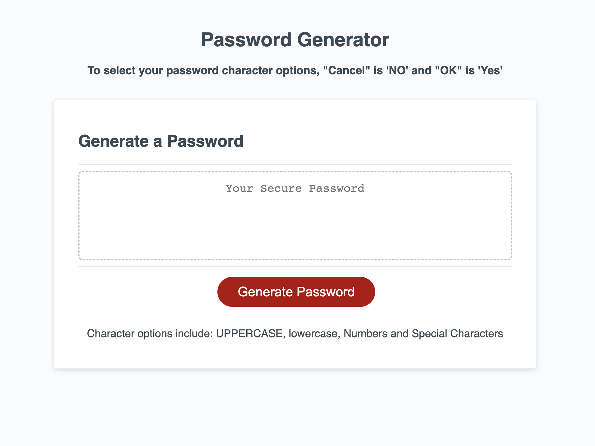
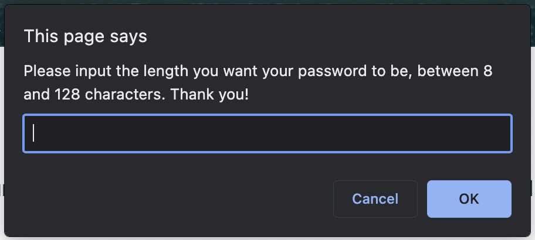
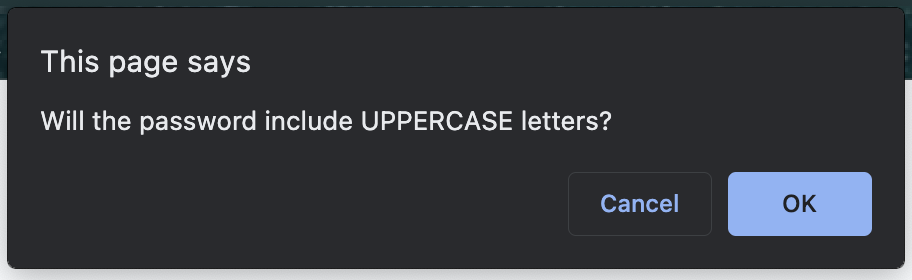
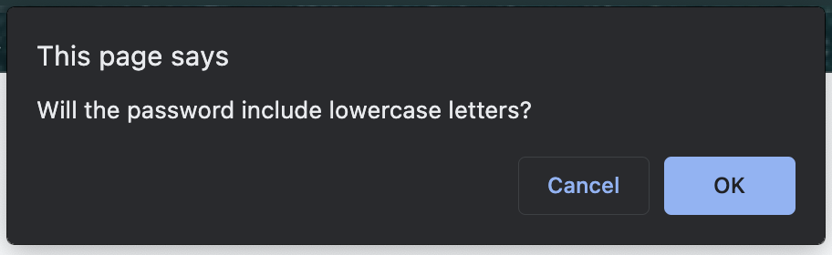
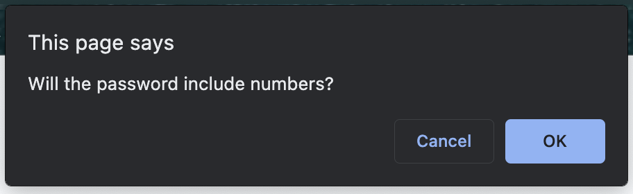
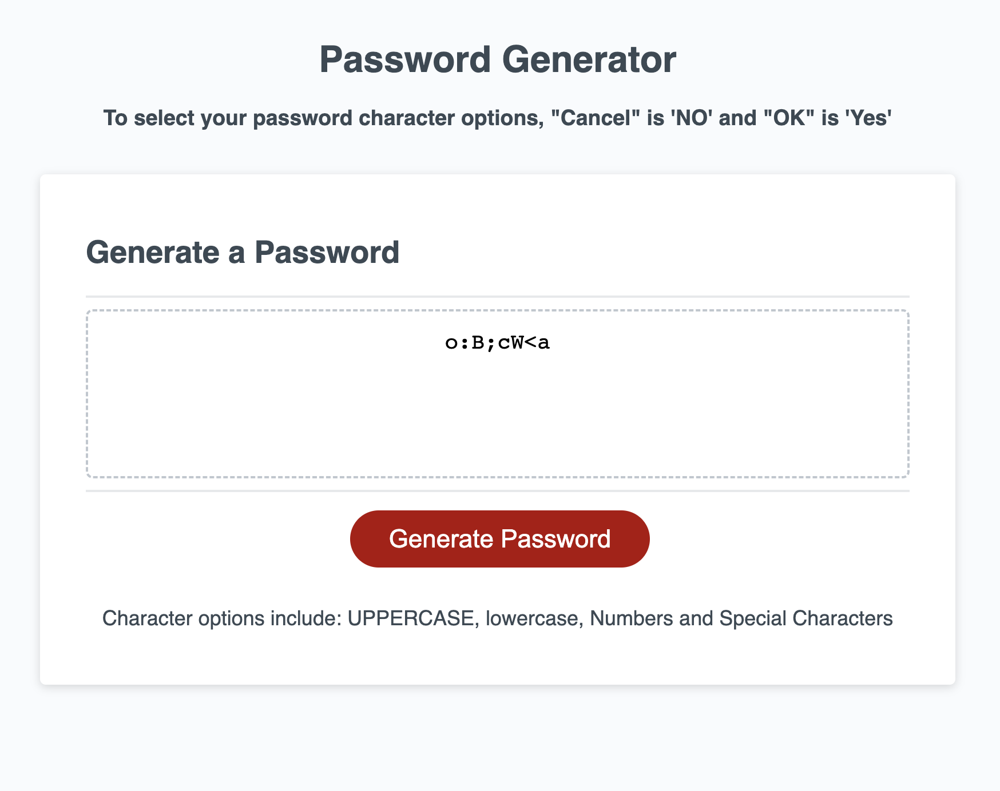

# [Password Generator](http://google.com)

## Table of Contents
  - [Description](#description📝)
  - [Installation](#installation💻)
  - [Usage](#usage👨‍💻)
  - [Features](#features🎁)
  - [Credits](#credits📣)
  - [Resources](#resources🛠️)
  - [License](#licenses🔍)

## Description📝
  "Password Generator" is a user-friendly JavaScript password generator app designed to create strong and secure passwords for online accounts. It offers customizable complexity options, including password length, UPPERCASE and lowercase character types, numbers and special symbols. Password Generator can generate both secure, random passwords to sercure your important data. The app prioritizes user privacy and does not require any registration or subscription, making it a convenient and reliable tool to enhance online security.

## Installation💻
  The provided URL will redirect users to a user-friendly website, obviating the need for any user-initiated installations. This application supports most browsers.
  [Live Demo Link](http://google.com) 

## Usage👨‍💻
  ### Homepage, shows the user basic instructions on how to use the application.
  # 

  ### "Click" the Generate Password button to start the application.
  # 

  ### An "Alert" will begin with a prompt for user to choose between 8 to 128 characters.
  # 

  ### Second "Prompt" will ask user is they need UPPERCASE letters in their password. 
  # 
  

  ### Third "Prompt" will ask user if they need lowercase letters.   
  # 

  ### Fourth "Prompt" will ask user if they need numbers included.
  # 

  ### Last "Prompt" will ask user if they need special characters in their password.
  # 

  ### Final product will be user password inside the dotted box.
  # 

## Features🎁
   ### - Easy user interface.   
   ### - Secure password management.  
   ### - Secure password creation using JavaScript

## Credits📣
  Daniel Morante 
  [Github Profile JMorante89](https://github.com/JMorante89)

## Resources🛠️
  Bootcamp starter code

## Licenses🔍
     

